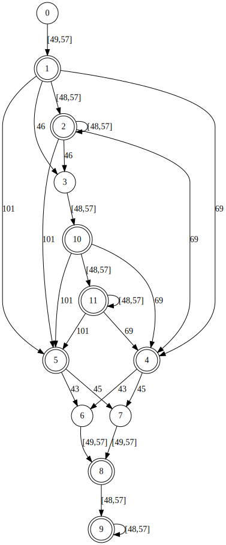
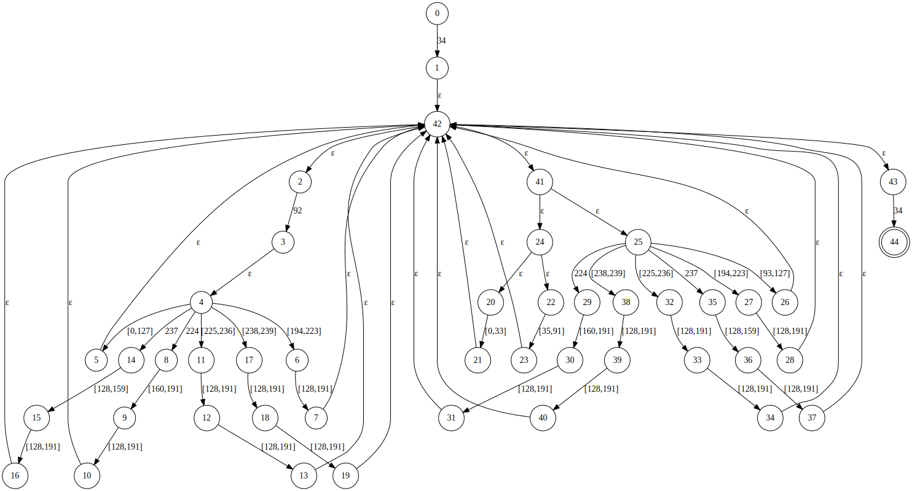

# Particle - A practice in writing parser gens

A hobby project as I learn compiler theory as well as rust.

## Planned Features

Currently there exists two major form of parser gens:

1. Parser gens like Yacc(or Bison), ANTLR and javacc needs developers to write an external syntax description file which will then be converted into source code by these generators. These generators are indeed fancy and powerful, but its relatively hard to customize.
2. Parser combinators are good, intuitive and simple, they do not require developer to write external files, instead, syntax rules are encoded in the source code directly. That being said, since parser combinators are "combinators", each of the combinator cannot really have a big picture of the source being parsed, therefore error handling can be hard.

Particle aims to be the hybrid of two forms listed above, to be exact, it is designed to be:

1. No external description files. Just put your syntax rules in the source code.
2. Fast. This is why I choose Rust as the language instead of Java or Go.
3. One-stop. Particle will cover both lexers and parsers. If possible, auto bindings to AST elements will be available too.
   
## Currently implemented Features

### NFA and DFA and Regex

In the example below, we will try to construct an NFA that recognizes number literals, namely, that can be accepted by the regex:

```
[1-9][0-9]*(\.[0-9]+)?([eE](\+|-)?[1-9][0-9]*)?
```

#### Construction By Hand 

Particle offers really low-level interfaces that help you construct an NFA from ground-up:

```rust
use particle::automatons::NFA;
// Character close intervals are constructed by calling NFA::from(char tuple)
// & and | are overloaded for simplicity
// The integer part [1-9][0-9]*
let int_part = NFA::from(('1', '9')) & NFA::from(('0', '9')).zero_or_more();
// The float part \.[0-9]+
let float_part = NFA::from('.') & NFA::from(('0', '9')).one_or_more();
// Exponents [eE](\+|-)?[1-9][0-9]*
let exp_part = (NFA::from('e') | NFA::from('E'))
        & (NFA::from('+') | NFA::from('-')).optional()
        & NFA::from(('1', '9'))
        & (NFA::from(('0', '9')).zero_or_more());
// Putting them together!
let nfa = int_part & float_part.optional() & exp_part.optional();    
```

That's really a large amount of work! We see `NFA::from()` everywhere! Notice that though we can somehow reuse `int_part` in the definition of `exp_part`, this will move `int_part` and we will not be able to use it anymore.

How can we be sure that the nfa we construct is right? `NFA` has implemented the Debug Trait, see:

```rust
println!("{:#?}", nfa);
```
And this is what we get:

```
digraph NFA {
        N0[label="0", shape=circle];
        N1[label="1", shape=circle];
        ...
        N24 -> N25[label="[48,57]"];
        N24 -> N26[label="ε"];
        N25 -> N24[label="ε"];
}
```

This is a DOT language script intented to be rendered in *Graphviz* to visualize our NFA.

#### Using `compile_regex`

As shown above, it takes lots of code to construct the NFA by hand. Luckily, Particle also offers a function `compile_regex` to help us:

```rust
let nfa = particle::regex::compile_regex(r#"[1-9][0-9]*(\.[0-9]+)?([eE](\+|-)?[1-9][0-9]*)?"#);
```

As you can see, that does everything for you. 
For simplicity, only a few key features of regex are supported:
1. Grouping `()`
2. Bracket `[...]` and `[^...]`
3. Branching `()`
4. Repetition `+` and `-` (`{m, n}` are not supported)
5. Optional `?`
6. Escape characters
   
Advanced features like zero-width assertions and named captures are not, and **will not** be supported since that's generally an overkill for building lexers. 

If you print this NFA out and observe it in Graphviz, the NFA this time should be really similar to the one that is constructed by hand, except that the id assigned for states will probably be different.

#### Converting NFA to DFA

This step is really easy since the function `DFA::from()` does everything for you:

```rust
use particle::automatons::DFA;
let dfa = DFA::from(nfa);
```

The implementation of `Debug` for `DFA` also prints the GraphViz script of the DFA. The DFA is much smaller than the original NFA so its graph can be put here:



The DFA here is not minimized, and the number labeled on its edges are the ASCII of characters. Both NFAs and DFAs here work on `u8`, and unicode characters will be encoded at most 4 UTF-8 `u8` input in both automatons.

#### Minimizing DFA

Though the size of a DFA doesn't have that much impact on how fast it runs, having a minimized DFA is no bad for us. For example, the minimized DFA for the DFA above can be constructed using:

```rust
let dfa = dfa.minimize();
```

which is:


This is especially useful when dealing with complex DFAs. For instance, consider the regex matching strings:

```rust
let nfa = regex::compile_regex(r#"\"([^\\\"]|\\.)*\""#);
```

Due to the nature of UTF-8 encoding, this produces an already complicated NFA:



If we convert this to DFA using powerset construction, the result will even frustrate Graphviz:


But after minimizing it, things become much clearer:


## TODO List
1. Wrapping DFA into lexer
2. ~~Better interface to contruct NFA~~
3. Optimizing DFA performance
4. Char class in NFA implementation
5. LL Parser gen
6. DFA Minimization